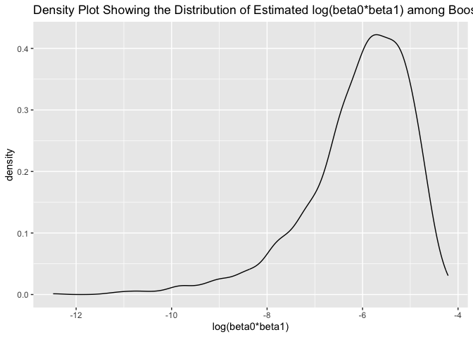
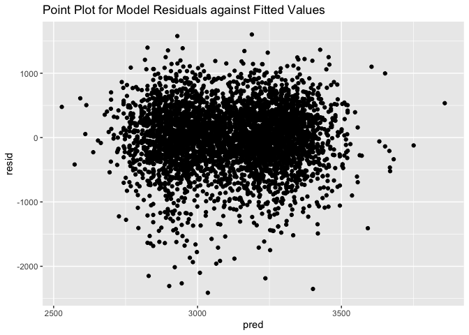

p8105_hw6_lz2951
================
lz2951
2023-12-01

``` r
library(tidyverse)
```

    ## ── Attaching core tidyverse packages ──────────────────────── tidyverse 2.0.0 ──
    ## ✔ dplyr     1.1.3     ✔ readr     2.1.4
    ## ✔ forcats   1.0.0     ✔ stringr   1.5.0
    ## ✔ ggplot2   3.4.3     ✔ tibble    3.2.1
    ## ✔ lubridate 1.9.2     ✔ tidyr     1.3.0
    ## ✔ purrr     1.0.2     
    ## ── Conflicts ────────────────────────────────────────── tidyverse_conflicts() ──
    ## ✖ dplyr::filter() masks stats::filter()
    ## ✖ dplyr::lag()    masks stats::lag()
    ## ℹ Use the conflicted package (<http://conflicted.r-lib.org/>) to force all conflicts to become errors

``` r
library(modelr)
library(mgcv)
```

    ## Loading required package: nlme
    ## 
    ## Attaching package: 'nlme'
    ## 
    ## The following object is masked from 'package:dplyr':
    ## 
    ##     collapse
    ## 
    ## This is mgcv 1.9-0. For overview type 'help("mgcv-package")'.

``` r
library(purrr)
set.seed(1)
```

# Problem 2

## Download data

``` r
weather_df = 
  rnoaa::meteo_pull_monitors(
    c("USW00094728"),
    var = c("PRCP", "TMIN", "TMAX"), 
    date_min = "2022-01-01",
    date_max = "2022-12-31") |>
  mutate(
    name = recode(id, USW00094728 = "CentralPark_NY"),
    tmin = tmin / 10,
    tmax = tmax / 10) |>
  select(name, id, everything())
```

    ## using cached file: /Users/zhanglongyu/Library/Caches/org.R-project.R/R/rnoaa/noaa_ghcnd/USW00094728.dly

    ## date created (size, mb): 2023-09-28 10:20:43.471338 (8.524)

    ## file min/max dates: 1869-01-01 / 2023-09-30

## Boostrap

``` r
boostrap_results =
  weather_df |>
  modelr::bootstrap(n = 5000) |> 
  mutate(
    models = map(strap, \(df) lm(tmax ~ tmin + prcp, data = df)),
    results = map(models, broom::tidy),
    glances = map(models, broom::glance)
  ) |>
  select(-strap, -models) |>
  unnest(glances) |>
  select(.id, results, r.squared) |>
  unnest(results) |>
  select(.id, r.squared, term, estimate) |>
  pivot_wider(names_from = term, values_from = estimate) |>
  select(-`(Intercept)`) |>
  mutate(logbeta = log(tmin * prcp))
```

    ## Warning: There was 1 warning in `mutate()`.
    ## ℹ In argument: `logbeta = log(tmin * prcp)`.
    ## Caused by warning in `log()`:
    ## ! NaNs produced

## Plot

The distribution of ${\hat{r}}^2$:

``` r
boostrap_results |>
  ggplot(aes(x = r.squared)) + 
  geom_density() +
  ggtitle("Density Plot Showing the Distribution of Estimated Squared r among Boostrap")
```

<!-- -->

According to the density plot, the distribution of squared r is
essentially a symmetric bell-shaped curve. The range of squared r falls
between 0.87 and 0.95, with a peak around 0.92. This indicates that the
predictive performance of the simple linear regression model for
predicting tmax using tmin and prcp as predictors is satisfactory. The
distribution of squared r is not apparently skewed, suggesting that
squared r is not significantly influenced by individual outlier values.

The distribution of $log(\hat{\beta}_1*\hat{\beta}_2)$

``` r
boostrap_results |>
  ggplot(aes(x = logbeta)) + 
  geom_density() +
  ggtitle("Density Plot Showing the Distribution of Estimated log(beta0*beta1) among Boostrap") +
  xlab("log(beta0*beta1)")
```

    ## Warning: Removed 3361 rows containing non-finite values (`stat_density()`).

<!-- -->

According to the density plot, the distribution of
$log(\hat{\beta}_1*\hat{\beta}_2)$ is a left-skewed curve. The peak of
$log(\hat{\beta}_1*\hat{\beta}_2)$ falls around -5.5. This obviously
left-skewed distribution of $log(\hat{\beta}_1*\hat{\beta}_2)$ suggests
that $log(\hat{\beta}_1*\hat{\beta}_2)$ is significantly influenced by
individual extremely small values.

The 95% confidence interval for ${\hat{r}}^2$ is (0.8885495, 0.9406812)

The 95% confidence interval for $log(\hat{\beta}_1*\hat{\beta}_2)$ is
(-8.9815594, -4.6016727)

# Problem 3

## Import and clean data

``` r
birthwt_df =
  read_csv("./data/birthweight.csv") |>
  mutate(
    babysex = factor(babysex, levels = c("1", "2"), labels = c("male", "female")),
    frace = factor(frace, levels = c("1", "2", "3", "4", "8", "9"),
                      labels = c("White", "Black", "Asian", "Puerto Rican", "Other", "Unknown")),
    malform = factor(malform, levels = c("0", "1"), labels = c("absent", "present")),
    mrace = factor(mrace, levels = c("1", "2", "3", "4", "8"), 
                      labels = c("White", "Black", "Asian", "Puerto Rican", "Other"))
  )
```

    ## Rows: 4342 Columns: 20
    ## ── Column specification ────────────────────────────────────────────────────────
    ## Delimiter: ","
    ## dbl (20): babysex, bhead, blength, bwt, delwt, fincome, frace, gaweeks, malf...
    ## 
    ## ℹ Use `spec()` to retrieve the full column specification for this data.
    ## ℹ Specify the column types or set `show_col_types = FALSE` to quiet this message.

## My own model

Intuitively, it’s reasonable that the mother’s physique and race are
related to birth weight of the baby. So I choose mheight, mrace and
ppbmi as predictors. This model is baesd on a hypothesized structure for
the factors that underly birthweight.

``` r
my_model = lm(bwt ~ mheight + mrace + ppbmi, data = birthwt_df)

my_model |> 
  broom::tidy() |> 
  select(term, estimate, p.value) |> 
  knitr::kable(digits = 5)
```

| term              |   estimate | p.value |
|:------------------|-----------:|--------:|
| (Intercept)       |  567.02424 | 0.00313 |
| mheight           |   35.23304 | 0.00000 |
| mraceBlack        | -306.97062 | 0.00000 |
| mraceAsian        |  -17.19262 | 0.81602 |
| mracePuerto Rican | -123.10674 | 0.00021 |
| ppbmi             |   20.97079 | 0.00000 |

The most p.value of terms in this model are significant, suggesting my
model is reasonable.

Add residuals and fitted values, make plot.

``` r
birthwt_df |>
  modelr::add_residuals(my_model) |>
  modelr::add_predictions(my_model) |>
  ggplot(aes(x = pred, y = resid)) + 
  geom_point() +
  ggtitle("Point Plot for Model Residuals against Fitted Values")
```

<!-- -->

## Compare three models

Fit three models and calculate rmse.

``` r
cv_df = 
  crossv_mc(birthwt_df, 100) 
cv_df = 
  cv_df |> 
  mutate(
    my_mod  = map(train, \(df) lm(
      bwt ~ mheight + mrace + ppbmi, data = df)),
    main_mod  = map(train, \(df) lm(
      bwt ~ blength + gaweeks, data = df)),
    interaction_mod  = map(train, \(df) lm(
      bwt ~ bhead*blength*babysex, data = df))
    ) |> 
  mutate(
    rmse_my = map2_dbl(my_mod, test, \(mod, df) rmse(model = mod, data = df)),
    rmse_main = map2_dbl(main_mod, test, \(mod, df) rmse(model = mod, data = df)),
    rmse_interaction = map2_dbl(interaction_mod, test, \(mod, df) rmse(model = mod, data = df)))
```

Make violin plot

``` r
cv_df |> 
  select(starts_with("rmse")) |> 
  pivot_longer(
    everything(),
    names_to = "model", 
    values_to = "rmse",
    names_prefix = "rmse_") |> 
  mutate(model = fct_inorder(model)) |> 
  ggplot(aes(x = model, y = rmse)) + 
  geom_violin() +
  ggtitle("Comparison of RMSE among Three Different Models")
```

<!-- -->

According to the violin plot, the cross-validated rmse of main effects
model and interaction model are obviously smaller than my own model.
Between these two models, interaction model’s performance is even
better, with lower rmse and more concentrated rmse distribution. So the
interaction model is the optimal among all three models.
